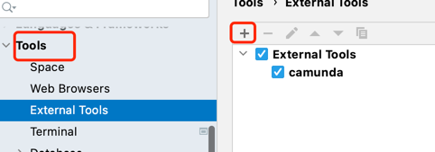
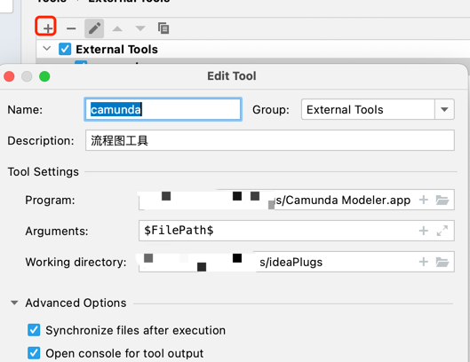
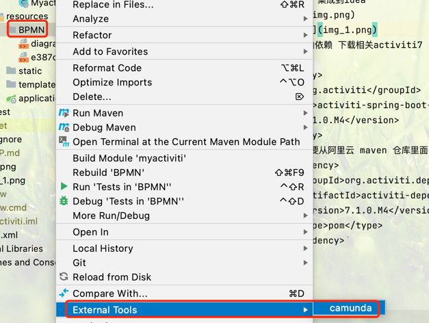
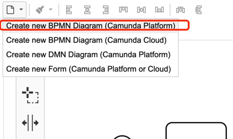

### 初始化项目
 1. 新建项目,在pom文件中添加boot项目常用依赖(主要是数据库drivers) 在yml 配置文件中添加数据库链接信息
 2. 在数据库链接 url上加上配置 &nullCatalogMeansCurrent=true
 3. 在resources文件夹下配置新建一个bpmn文件夹并在文件夹下新建一个文件，
    内容随意 流程随意(推荐软件 camunda idea版本问题，需要类似此软件制作流程图)
    3.1 camunda 集成到idea
    
    
    
    
 4. 在maven中添加依赖 下载相关activiti7 的jar包依赖 及其他基本依赖
    ```
    <dependency>
    <groupId>org.activiti</groupId>
    <artifactId>activiti-spring-boot-starter</artifactId>
    <version>7.1.0.M4</version>
    </dependency>
        <!-- 需要从阿里云 maven 仓库里面 找到这个版本         <type>pom</type>    -->
    <dependency>
        <groupId>org.activiti.dependencies</groupId>
        <artifactId>activiti-dependencies</artifactId>
        <version>7.1.0.M4</version>
        <type>pom</type>
    </dependency>
    ```
 5. 启动项目 会在数据库自动生成关于activiti的部分数据库表
 6. 执行 src/main/resources/sql/userInit.sql 数据库相关脚本 修复activiti的相关问题
 7. 在application.yml上 再次新增配置 
   ``` 
    spring:
      activiti:
        history-level: full # 历史记录等级 全部
        db-history-used: true # 使用历史记录
        check-process-definitions: false # 检查流程定义
  ```
 8. 再次启动项就会生成剩余的全部activiti数据库表